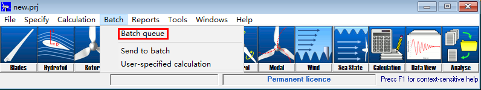
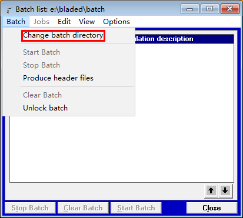
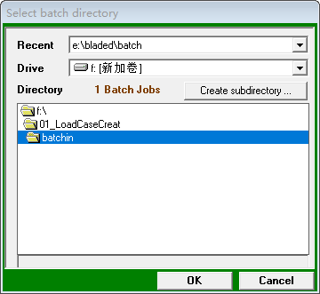
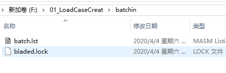
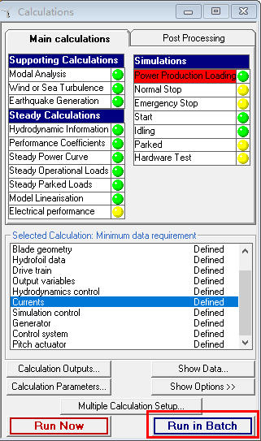
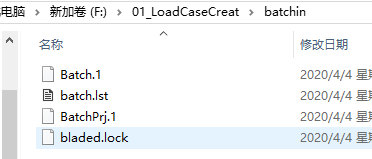
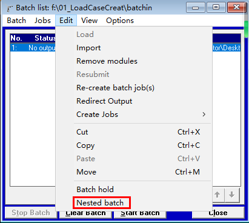

#Blade模板文件生成

这里选择生成结果文件夹，不要选在batchin中，因为我们只需要中间文件，不需要结果文件,
可以随便选择一个文件夹，点击确定后，会生成如下文件

可以看到此时多出了两个文件Batch.1和BatchPrj.1，这两个文件都是用来存储我们设置的工
况的；batch.lst存储了bladed计算顺序。因此我们只需要编辑这三个文件，前两个文件中进
行参数替换，后一个文件写好计算顺序，然后把.lst文件导入bladed就可以进行计算了，关
于.lst文件导入会在后面说明。

#生成工况x的模板文件
步骤同上，工况x的模板文件存储在batch_shoudong中，然后使用代码对比工具比较batch_shoudong
和batchin文件中的Batch.1和BatchPrj.1文件，这样就可以看出是哪些元素发生了变化，然后以batchin
中的文件作为模板，修改参数，生成文件Batch.x和BatchPrj.x(一个小工况就会有一个数字x)；修
改batch.lst中计算的顺序，导入bladed，导入方法见下：

选择batch.lst文件导入，然后Start Batch即可开始计算

#注意：本程序只适用于bladed4.3，其他版本可以自行编写

